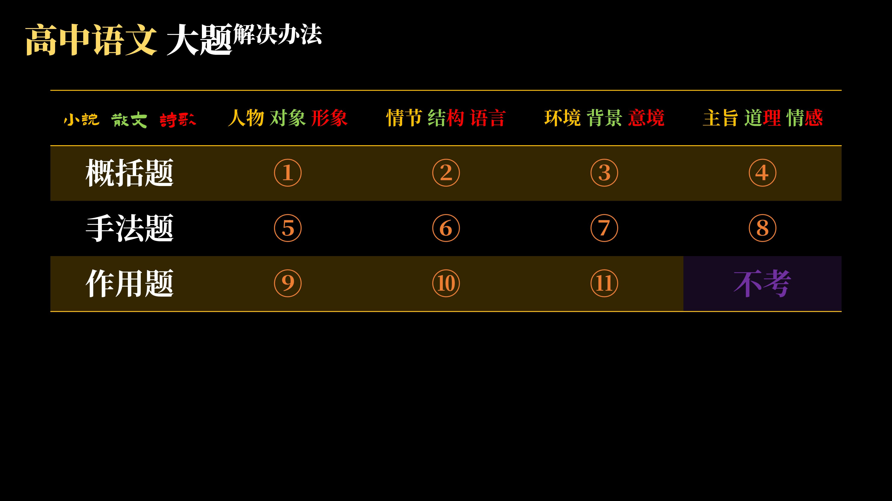
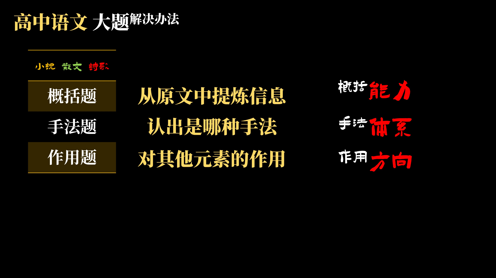
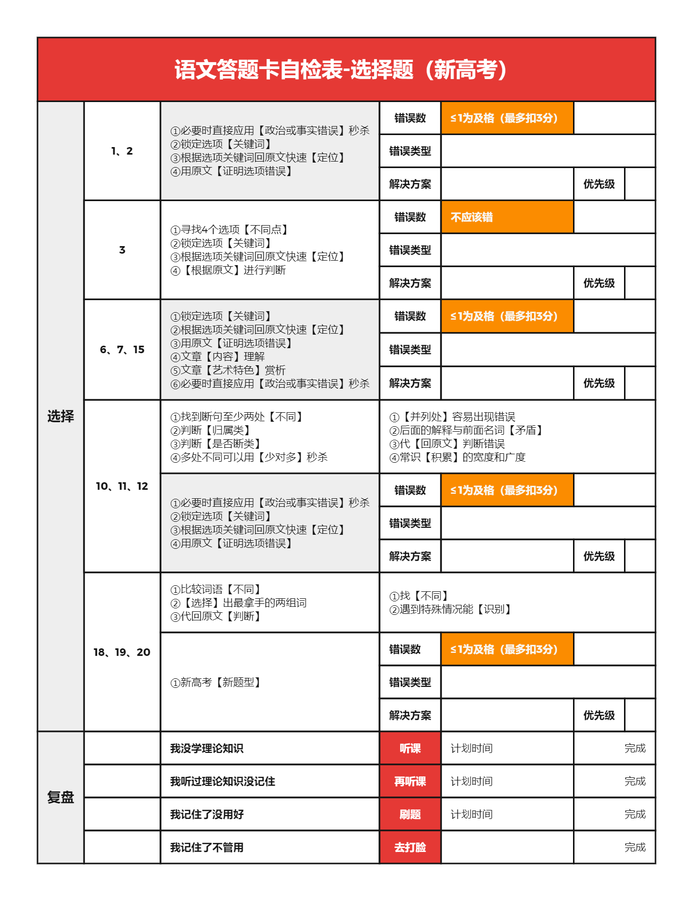

### P1学习方法
先看题目，专攻薄弱，审炼套练，学有所得

### P2选择题题型
排除法（看错误）：全真则真，一假则假
证明：用原文，用事实
找原文：找选项关键词（选项与原文不会
发生改变），锁定原文范围
翻译：找不到关键词，将选项转换为原文
思考：用原文逻辑判断选项正误

类型：
（先解决）
古诗、实用t12/论述t1/信息t1、小说散文、文言文t3、论述t23、信息t23
（后解决）文言文t2、语言文字运用
（集中突破）断句选择题

### P3大题题型
#### 三大类型：概括题（what）、手法题（how）、作用题（why）
先判断题目是否为手法和作用，否则则为概括题

### P4时间分配
- 先别看作文，先看小说散文
- 考前多练习
- 作文最少留一小时

### 选择题自检表

