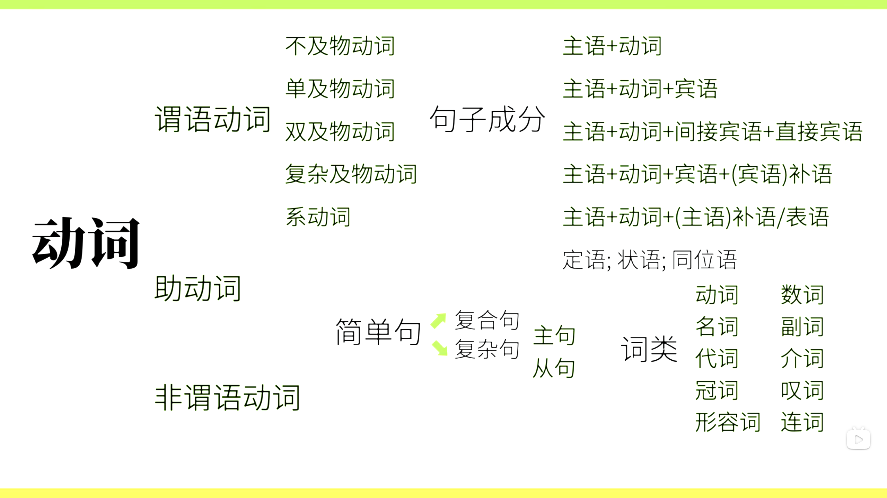

### 基本句（简单句）：什么+怎么样
#### 谓语动词搭配（基本句型）
1.可以独立完成的动作
主语+==不及物动词==
例：Papa Rabbit sleeps.
2.有一个动词承受者
主语+==单及物动词==+宾语
例：Papa Rabbit likes you.
3.有两个动作承受者
主语+==双及物动词==+间接宾语+直接宾语
例：Papa Rabbit teaches you English.
4.有一个动作承受者，但需要补充
主语+==复杂及物动词==+宾语+(宾语)补语
例：Papa Rabbit considers you smart.
5.非“动作”
主语+==系动词==+(主语)补语/表语
例：Papa Rabbit smells nice.

总结：主语+谓语
谓语⊇谓语动词

#### 句子成分
- 主语
- 谓语动词
- 宾语
- 宾语补语
- 主语补语
- 定语：修饰主语或宾语
    例：**The little white** rabbit ate **a large** carrot.
- 状语：修饰谓语动词
    例：The rabbit ate **quickly**.
- 同位语：把主语或宾语说一遍
    例：Papa Rabbit,an English teacher,eats carrots.

### 造句
#### 简单句
#### 复合句/并列句
#### 复杂句：主句+从句
- 名词性从句：
    - 主语从句
    - 宾语从句
    - 表语从句
    - 同位语从句
- 定语从句
- 状语从句

### 十大词类
- 名词(nouns)：表人和物
- 动词(verbs)
- 冠词(articles)：说明人和事物
- 代词(pronouns)：替代人和物
- 形容词(adjectives)：形容人和物
- 数词(numerals)：表数量
- 副词(adverbs)：修饰动词或形容词
- 介词(prepositions)：表示和其他词关系的词
- 叹词(interjections)：表感叹
- 连词(conjunctions)：连接词和句

### 谓语动词（时体气）
1.动作时间
- 现在
- 过去
- 将来
- 过去将来
2.动作状态
- 一般
- 完成
- 进行
- 完成进行
“时态”：时间+状态
3.动作假设、情感（语气）
- 虚拟语气：表示意愿，和事实相反的假设
- 陈述语气
- 祈使语气

### 助动词
have done：表示完成
be doing：表示正在进行
be done：表示被怎么样
can do：表示能够怎么样
might do：表示可能怎么样
must do：表示必须怎么样
don't do：表示否定

### 非谓语动词
- 动词不定式
- 现在分词
- 动名词
- 过去分词

